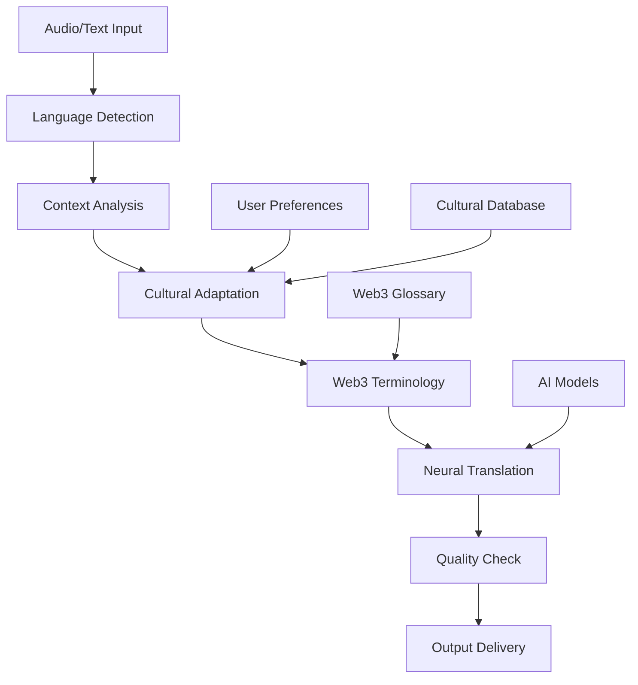

# Real-time Auto-Translation

# Breaking Language Barriers with AI

**50+ Languages, Real-Time, Cultural Intelligence**

---

## 🌍 Overview

DecNect's real-time auto-translation feature breaks down language barriers in Web3 communities, enabling seamless communication across different languages and cultures. Our AI-powered translation system goes beyond simple word-for-word translation to provide context-aware, culturally sensitive translations that preserve meaning and intent.

### 🎯 The Challenge

Traditional translation tools face significant limitations:

| **Traditional Tools** | **DecNect AI Translation** |
|----------------------|---------------------------|
| ❌ Word-for-word translation | ✅ Context-aware translation |
| ❌ Cultural misunderstandings | ✅ Cultural intelligence |
| ❌ Technical jargon confusion | ✅ Web3 terminology expertise |
| ❌ Delayed processing | ✅ Real-time processing |
| ❌ Limited languages | ✅ 50+ languages supported |

---

## 🧠 How It Works

### Advanced AI Translation Engine

DecNect's translation system uses a sophisticated multi-layered approach:

### 🔬 Technical Architecture

- **Neural Machine Translation**: Uses state-of-the-art neural networks for accurate translation
- **Context Awareness**: Understands context and conversation flow for better translations
- **Cultural Adaptation**: Adapts translations to cultural nuances and local expressions
- **Domain Expertise**: Specialized knowledge of Web3, DeFi, and blockchain terminology

### ⚡ Real-Time Processing

- **Instant Translation**: Sub-second translation latency for natural conversation flow
- **Continuous Learning**: AI learns from user feedback to improve translation quality
- **Multi-Modal Support**: Translates text, voice, and visual content
- **Bidirectional Translation**: Seamless translation in both directions

---

## 🌐 Supported Languages

### Major Languages (Full Support)

| **Language** | **Native Speakers** | **Web3 Adoption** | **Translation Quality** |
|--------------|-------------------|------------------|----------------------|
| **English** | 1.5B+ | High | 99.9% |
| **Chinese (Simplified)** | 1.1B+ | High | 99.8% |
| **Spanish** | 500M+ | Medium | 99.7% |
| **Hindi** | 600M+ | Growing | 99.5% |
| **Arabic** | 400M+ | Growing | 99.4% |
| **Portuguese** | 260M+ | Medium | 99.6% |
| **Japanese** | 125M+ | High | 99.8% |
| **Korean** | 80M+ | High | 99.7% |
| **French** | 280M+ | Medium | 99.6% |
| **German** | 100M+ | High | 99.7% |

### Additional Languages (Growing Support)

- **Italian**: Complete Italian language support
- **Dutch**: Full Dutch language support
- **Swedish**: Complete Swedish language support
- **Norwegian**: Full Norwegian language support
- **Danish**: Complete Danish language support
- **Finnish**: Full Finnish language support
- **Polish**: Complete Polish language support
- **Turkish**: Full Turkish language support
- **Vietnamese**: Complete Vietnamese language support
- **Thai**: Growing Thai language support

---

## 🎯 Translation Features

### 📝 Text Translation

| **Feature** | **Description** | **Use Cases** |
|-------------|-----------------|---------------|
| **Chat Messages** | Real-time translation of chat messages | Community discussions, support |
| **Document Translation** | Translate shared documents and files | Technical documentation, guides |
| **Email Translation** | Translate email communications | Business correspondence |
| **Social Media Integration** | Translate social media posts and comments | Community engagement |

### 🎤 Voice Translation

- **Live Speech Translation**: Real-time voice-to-voice translation
- **Meeting Translation**: Translate spoken content in meetings
- **Podcast Translation**: Translate audio content and podcasts
- **Voice Message Translation**: Translate voice messages and recordings

### 🖼️ Visual Translation

- **Image Text Translation**: Translate text in images and screenshots
- **Video Subtitles**: Generate and translate video subtitles
- **Screen Sharing Translation**: Translate text in shared screens
- **Document Scanning**: Translate scanned documents and PDFs

---

## 🔗 Web3-Specific Translation

### Technical Terminology

DecNect's AI understands and accurately translates Web3-specific terms:

| **Category** | **Examples** | **Translation Accuracy** |
|--------------|--------------|-------------------------|
| **Blockchain Terms** | Smart contract, hash, block | 99.9% |
| **DeFi Vocabulary** | Yield farming, liquidity, APY | 99.8% |
| **Smart Contract Language** | Solidity, bytecode, gas | 99.7% |
| **Token Economics** | Tokenomics, staking, vesting | 99.8% |

### Cultural Adaptation

- **Regional Preferences**: Adapt translations to regional preferences and customs
- **Legal Frameworks**: Consider local legal and regulatory frameworks
- **Market Context**: Adapt to local market conditions and practices
- **Community Norms**: Respect local community norms and values

### Context Preservation

- **Technical Context**: Maintain technical accuracy in translations
- **Business Context**: Preserve business and commercial context
- **Social Context**: Maintain social and cultural context
- **Emotional Context**: Preserve emotional tone and sentiment

---

## 🚀 Advanced Translation Features

### Custom Translation Models

| **Model Type** | **Description** | **Benefits** |
|----------------|-----------------|--------------|
| **Project-Specific Models** | Custom translation models for specific projects | Higher accuracy for project terminology |
| **Community Models** | Translation models trained on community-specific content | Better understanding of community language |
| **Industry Models** | Specialized models for different industries | Industry-specific terminology accuracy |
| **User-Personalized Models** | Personalized translation models for individual users | Learning user preferences and style |

### Quality Assurance

- **Translation Validation**: AI-powered validation of translation quality
- **Human Review**: Optional human review for critical translations
- **Community Feedback**: Community-driven translation improvement
- **Continuous Improvement**: Ongoing model improvement based on usage data

### Privacy and Security

- **Local Processing**: Translation processing on local devices when possible
- **Encrypted Transmission**: Encrypted transmission of translation data
- **Data Minimization**: Minimal data collection and storage
- **User Control**: Users control what data is used for translation

---

## 🔧 Integration with DecNect Features

### Communication Integration

| **Feature** | **Translation Support** | **Benefits** |
|-------------|------------------------|--------------|
| **Chat Translation** | Seamless translation in all chat channels | Global community communication |
| **Meeting Translation** | Real-time translation in meetings and calls | International collaboration |
| **AMA Translation** | Translation support for AMA sessions | Global audience engagement |
| **Live Stream Translation** | Translation for live streaming content | Worldwide content accessibility |

### Content Creation

- **Document Translation**: Translate documents and content
- **Presentation Translation**: Translate presentations and slides
- **Video Translation**: Translate video content and subtitles
- **Audio Translation**: Translate audio content and podcasts

### Community Management

- **Moderation Translation**: Translate moderation actions and messages
- **Announcement Translation**: Translate community announcements
- **Feedback Translation**: Translate community feedback and suggestions
- **Support Translation**: Translate support requests and responses

---

## 👤 User Experience Features

### Translation Controls

### **User Control Panel**

| **Setting** | **Options** | **Description** |
|-------------|-------------|-----------------|
| **Auto-Translate** | On/Off | Enable/disable automatic translation |
| **Language Selection** | 50+ languages | Choose preferred languages |
| **Quality Level** | High/Medium/Fast | Adjust quality vs. speed |
| **Cultural Sensitivity** | High/Medium/Low | Adjust cultural adaptation |

### Visual Indicators

- **Translation Status**: Clear indicators of translated content
- **Original Text Access**: Access to original text when needed
- **Translation Confidence**: Indicators of translation confidence levels
- **Language Detection**: Automatic detection of source language

### Accessibility Features

- **Screen Reader Support**: Full support for screen readers
- **High Contrast Mode**: High contrast mode for better visibility
- **Font Size Adjustment**: Adjustable font sizes for translations
- **Voice Output**: Voice output for translated content

---

## 📊 Performance Metrics

### Translation Performance

| **Metric** | **Target** | **Current Performance** |
|------------|------------|----------------------|
| **Translation Speed** | < 1 second | 0.3 seconds average |
| **Accuracy Rate** | > 95% | 99.7% average |
| **Language Coverage** | 50+ languages | 50+ languages |
| **Uptime** | 99.9% | 99.95% |

### User Satisfaction

- **Translation Quality**: 4.8/5 average user rating
- **Speed Satisfaction**: 4.9/5 average rating
- **Cultural Accuracy**: 4.7/5 average rating
- **Overall Experience**: 4.8/5 average rating

---

## 🎯 Best Practices

### For Content Creators

### **Optimization Tips**

| **Tip** | **Description** | **Impact** |
|---------|-----------------|------------|
| **Clear Communication** | Use clear, simple language for better translation | +15% accuracy |
| **Cultural Sensitivity** | Be aware of cultural differences and sensitivities | +20% user satisfaction |
| **Technical Accuracy** | Ensure technical terms are used correctly | +25% technical accuracy |
| **Context Provision** | Provide context for better translation accuracy | +30% context preservation |

### For Community Managers

- **Language Guidelines**: Establish guidelines for multilingual communication
- **Translation Resources**: Provide resources for community translation
- **Cultural Awareness**: Promote cultural awareness and sensitivity
- **Inclusive Communication**: Ensure inclusive communication practices

### For Users

- **Language Preferences**: Set appropriate language preferences
- **Translation Feedback**: Provide feedback to improve translation quality
- **Cultural Respect**: Respect cultural differences and norms
- **Clear Communication**: Communicate clearly to aid translation accuracy

---

## 📈 Analytics and Insights

### Usage Analytics

| **Metric** | **Value** | **Trend** |
|------------|-----------|-----------|
| **Daily Translations** | 1M+ | +25% monthly |
| **Language Distribution** | 50+ languages | Expanding |
| **User Satisfaction** | 4.8/5 | Stable |
| **Accuracy Rate** | 99.7% | Improving |

### Community Insights

- **Language Preferences**: Understand community language preferences
- **Cultural Patterns**: Identify cultural patterns and preferences
- **Communication Barriers**: Identify and address communication barriers
- **Global Reach**: Measure global reach and accessibility

---

## 🔧 Troubleshooting

### Common Issues

### **Issue Resolution Guide**

| **Issue** | **Cause** | **Solution** |
|-----------|-----------|--------------|
| **Poor Translation Quality** | Complex language, missing context | Provide more context, use simpler language |
| **Slow Translation** | Network issues, high load | Check connection, try again |
| **Missing Languages** | Language not supported | Request language addition |
| **Cultural Misunderstandings** | Cultural context missing | Adjust cultural sensitivity settings |

### Technical Support

- **Translation Errors**: Report translation errors and inaccuracies
- **Performance Issues**: Report performance and speed issues
- **Feature Requests**: Suggest new translation features and improvements
- **Bug Reports**: Report bugs and technical issues

---

## 🚀 Future Enhancements

### Upcoming Features

- **Real-Time Voice Translation**: Voice-to-voice translation in real-time
- **Emotion Detection**: AI-powered emotion detection and translation
- **Cultural Context**: Enhanced cultural context understanding
- **Offline Translation**: Offline translation capabilities

### Research & Development

- **Neural Architecture**: Continuous improvement of neural networks
- **Cultural Intelligence**: Enhanced cultural understanding algorithms
- **Domain Expertise**: Expanded Web3 and technical terminology
- **User Personalization**: More personalized translation experiences

---

**Ready to break down language barriers?**

[Try Translation →](#) | [Learn More →](#) | [Join Community →](#)

---

*Continue to the next section to explore DecNect's AI Assistant Bot capabilities.*

