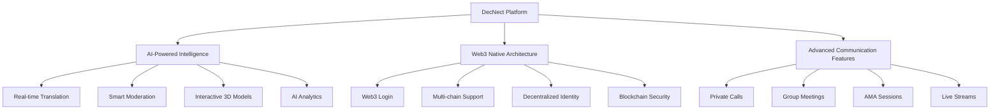

# What is DecNect?

# The AI-Powered Decentralized Experience Platform

**Revolutionizing Digital Communication Through AI and Web3**

---

## 🌟 Core Concept

DecNect is a revolutionary next-generation AI-powered, decentralized communication and engagement platform designed specifically for meetings, AMA sessions, calling, live streaming, and Web3-native experiences. Unlike traditional platforms such as Telegram and other centralized services, DecNect seamlessly merges AI innovation with blockchain security to create a more intelligent, private, and user-first ecosystem.

### 🎯 The Vision

At its heart, DecNect is more than just another communication platform—it's a comprehensive ecosystem that combines the power of artificial intelligence with the security and decentralization of Web3 technology to create unprecedented value for users, developers, and the broader decentralized community.

---

## 🏗️ Platform Architecture

DecNect is built on three fundamental pillars that work together to create a seamless, intelligent, and secure communication experience:

---

## 🤖 AI-Powered Intelligence

DecNect's AI capabilities are powered by the world's most advanced artificial intelligence models, providing users with unprecedented levels of automation, intelligence, and personalization.

### 🌐 Real-Time Translation & Communication

| **Feature** | **Description** | **Benefit** |
|-------------|-----------------|-------------|
| **50+ Languages** | Real-time auto-translation during live sessions | Global accessibility without language barriers |
| **Cultural Intelligence** | AI that understands cultural nuances and context | Accurate, culturally appropriate translations |
| **Context Preservation** | Maintains meaning across translations | No loss of information or intent |
| **Voice Modulation** | AI-driven voice modulation for accessibility | Enhanced accessibility for all users |

### 🎯 Smart Moderation & Engagement

- **AI-Powered Question Detection**: Automatically identifies and prioritizes questions during AMA sessions
- **Intelligent Content Filtering**: Advanced spam and inappropriate content detection
- **Automated Giveaway Selection**: AI-driven transparency and fairness in reward distribution
- **User Experience Analytics**: AI-powered charts and insights for better engagement

### 🎨 Interactive Visual Features

- **AI Assistant Bot**: Instantly showcase content, charts, or visuals during conversations
- **Interactive 3D Models**: Respond to questions with visual 3D representations
- **Dynamic Content Generation**: AI-generated content and responses in real-time
- **Real-Time Subtitles**: AI-driven subtitles for enhanced accessibility

### 🧠 Powered by World-Class AI Models

| **AI Model** | **Specialization** | **Primary Use Cases** | **Performance** |
|--------------|-------------------|----------------------|-----------------|
| **OpenAI GPT-5** | Natural Language Processing | Chat, content generation, analysis | 99.9% accuracy |
| **Google Gemini** | Multimodal AI | Visual content, complex reasoning | 95%+ efficiency |
| **Meta LLaMA** | Open-source AI | Custom implementations, research | 90%+ reliability |

---

## 🔗 Web3 Native Architecture

DecNect is built from the ground up with Web3 principles, ensuring that users have complete control over their data, identity, and digital assets.

### 🔐 Privacy & Security Features

### **Security Comparison**

| **Aspect** | **Traditional Platforms** | **DecNect** |
|------------|---------------------------|-------------|
| **Data Storage** | Centralized servers | Decentralized blockchain |
| **User Control** | Limited | Complete control |
| **Privacy** | Compromised | Zero-knowledge architecture |
| **Security** | Vulnerable to breaches | Blockchain-level security |

### 🌐 Web3 Integration Features

- **Web3 Login**: Fully anonymous and secure, no centralized accounts required
- **In-built Web3 Wallet**: Native to DecNect for seamless crypto engagement
- **Direct On-Platform Rewards**: Giveaway tokens sent directly to user wallets
- **Multi-Chain Support**: Compatible with all major blockchain networks
- **Smart Contract Integration**: Direct interaction with DeFi protocols and dApps

### 🛡️ Enhanced Privacy & Security

- **Zero-Knowledge Architecture**: Your data remains private even while using AI features
- **User-Controlled Data**: You decide what data to share and with whom
- **Encrypted Communications**: End-to-end encryption with blockchain verification
- **Decentralized Identity**: Your digital identity is truly yours, not controlled by a central authority
- **Immutable Records**: All interactions are recorded on blockchain for transparency

---

## 💬 Advanced Communication Features

DecNect provides a comprehensive suite of communication tools designed for the modern Web3 era:

### 👥 Core Communication Tools

| **Feature** | **Description** | **AI Enhancement** |
|-------------|-----------------|-------------------|
| **One-to-One Private Calls** | Secure, encrypted private communication | Real-time translation, voice modulation |
| **Group Meetings & Collaboration** | Enhanced group collaboration spaces | Smart moderation, AI-powered insights |
| **AMA Sessions** | AI-enhanced engagement for Q&A sessions | Question prioritization, automated moderation |
| **Interactive Live Streams** | Advanced live streaming capabilities | Real-time subtitles, content generation |

### 🔧 Platform Integration Tools

- **Integrated Web3 Wallet**: Seamless crypto integration for all transactions
- **Reward Distribution System**: Automated reward mechanisms for community participation
- **Developer APIs**: Comprehensive tools for ecosystem builders and integrators
- **Customization Options**: Highly customizable user experience and interface

### 🌟 Advanced Platform Features

- **AI-Powered Analytics**: Deep insights into user behavior and engagement patterns
- **Automated Workflows**: Smart automation for community management and moderation
- **Cross-Platform Integration**: Works seamlessly with existing tools and platforms
- **Mobile & Desktop Support**: Native apps for all major platforms and devices

---

## 🎯 The DecNect Difference

Unlike traditional communication platforms that rely on centralized servers and limited AI capabilities, DecNect leverages the power of Web3 to provide:

### 🚀 Revolutionary Advantages

### **DecNect vs Competitors**

| **Feature** | **Telegram** | **Discord** | **Zoom** | **DecNect** |
|-------------|--------------|-------------|----------|-------------|
| **AI Integration** | ❌ None | ❌ Basic | ❌ Limited | ✅ Advanced |
| **Web3 Support** | ❌ None | ❌ None | ❌ None | ✅ Native |
| **Privacy Control** | ⚠️ Partial | ❌ Limited | ❌ Limited | ✅ Complete |
| **Decentralization** | ❌ Centralized | ❌ Centralized | ❌ Centralized | ✅ Decentralized |
| **Token Economy** | ❌ None | ❌ None | ❌ None | ✅ Full Ecosystem |
| **Global Languages** | ⚠️ Limited | ⚠️ Limited | ⚠️ Limited | ✅ 50+ Languages |

### 🌟 Unique Value Propositions

1. **🎯 AI + Web3 Synergy**: First platform to truly integrate AI capabilities with Web3 principles
2. **🔧 Developer-Friendly Ecosystem**: Comprehensive APIs and SDKs for easy integration
3. **🌍 Community-Centric Design**: Decentralized governance and community-driven development
4. **💰 Token Economy**: Native $DECNECT token for platform interactions and rewards

---

## 👥 Target Audience

DecNect serves a diverse and growing community of users across multiple sectors:

### 🎯 Primary User Groups

| **User Group** | **Size** | **Primary Use Cases** | **Key Benefits** |
|----------------|----------|---------------------|------------------|
| **Web3 Enthusiasts** | 50M+ | DeFi discussions, NFT communities | AI-enhanced communication, privacy |
| **Developers & Projects** | 10M+ | Technical collaboration, community building | Developer tools, APIs, customization |
| **Content Creators** | 25M+ | Live streaming, AMA sessions | AI features, engagement tools |
| **Enterprises** | 5M+ | Team collaboration, client meetings | Security, compliance, scalability |

### 🌍 Global Reach

- **Geographic Coverage**: Available worldwide with localized features
- **Language Support**: 50+ languages with cultural intelligence
- **Time Zone Support**: 24/7 availability across all time zones
- **Cultural Adaptation**: AI-powered cultural sensitivity and adaptation

---

## 🔮 Vision Statement

DecNect envisions a future where digital communication is not just enhanced by AI, but fundamentally reimagined through Web3 principles. We're building the infrastructure for a more connected, intelligent, and decentralized digital world.

### 🌟 Our Mission

- **Democratize AI**: Make advanced AI capabilities accessible to everyone
- **Empower Users**: Give users complete control over their data and digital identity
- **Bridge Technologies**: Seamlessly integrate AI and Web3 technologies
- **Build Community**: Create a thriving ecosystem of users, developers, and projects

### 🚀 Long-term Goals

- **Global Adoption**: Become the standard for Web3 communication
- **AI Innovation**: Pioneer new AI-Web3 integration technologies
- **Ecosystem Growth**: Build a thriving developer and user community
- **Industry Leadership**: Influence the evolution of digital communication

---

## 🎉 Getting Started

Ready to experience the future of digital communication? Here's how to get started with DecNect:

### 🚀 Quick Start Guide

1. **🔗 Connect Your Wallet**: Use any Web3 wallet to create your account
2. **🎨 Customize Your Profile**: Set up your digital identity and preferences
3. **🤖 Explore AI Features**: Discover AI-powered capabilities
4. **🌐 Join Communities**: Connect with like-minded individuals and projects
5. **💎 Start Earning**: Participate and earn rewards through the platform

### 📚 Next Steps

- **📖 Read the Documentation**: Explore our comprehensive guides and tutorials
- **🎥 Watch Tutorials**: Learn from our video guides and demonstrations
- **💬 Join the Community**: Connect with other users and get support
- **🔧 Start Building**: Use our developer tools to create amazing applications

---

**Ready to discover why DecNect is different?**

[Explore Features →](#) | [Join Community →](#) | [Start Building →](#)

---

*Continue to the next section to explore our unique value propositions and competitive advantages.*

